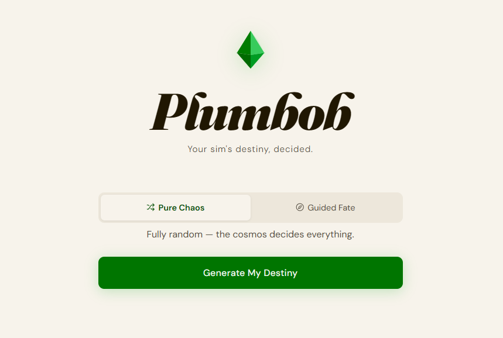

# Plumbob — Sims 4 Life Path Generator

> *Your sim's destiny, decided.*

A single-page web app that generates randomised life paths for Sims 4 characters. Built for players who open a new save and immediately think — *"but what should they actually do with their life?"*

---

## Features

- **Pure Chaos mode** — fully random across all categories and packs
- **Guided Fate mode** — pick one or more categories; each selected category gives you one result
- **137 life path entries** sourced directly from the Sims 4 wiki, including:
  - 54 full-time careers with real in-game branch titles, spanning Base Game through Royalty & Legacy (Astronaut → Space Ranger or Interstellar Smuggler, Noble → Kingdom Leader, etc.)
  - 11 part-time jobs with top-level titles (Simfluencer → Mega-Simfluencer, etc.)
  - 8 freelance trades
  - 12 university degrees
  - 36 business types — including 27 small business types from Businesses & Hobbies (coffee shop, pottery studio, tattoo parlor, comedy club, paranormal agency, and more)
  - 16 stay-at-home lifestyles
- **Wiki links** on every result — one click to the relevant Sims Wiki page
- **Reroll** within the same category
- Animated plumbob, smooth result transitions, keyboard accessible

---

## How to use

Open the app → choose Pure Chaos or Guided Fate → click **Generate My Destiny** → play your sim.

In Guided Fate, select multiple categories to get one result per category in a single roll.

**Live app:** [sydvibecoding.github.io/plumbob](https://sydvibecoding.github.io/plumbob)

---

## Data sources

Career branch titles, part-time job levels, and freelancer trades are sourced from [The Sims Wiki](https://sims.fandom.com) via the official MediaWiki API (`sims.fandom.com/api.php`). Business types are derived from retail, restaurant, vet, rental, and small business categories across multiple packs. Vibe text is original.

---

## Tech

No framework, no build step. One HTML file.

- [Fraunces](https://fonts.google.com/specimen/Fraunces) + [DM Sans](https://fonts.google.com/specimen/DM+Sans) via Google Fonts
- [Lucide](https://lucide.dev) icons via unpkg
- Vanilla JS
